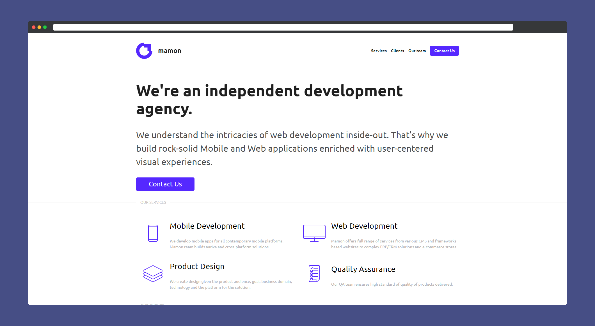

<h1 align="center">
  Mamon
</h1>
<!--
<h2 align="center">
  Travel to San Francisco Safely
</h2> -->

  

## 💻 Projeto

Esse projeto foi desenvolvido seguindo essa playlist [Анна Блок](https://www.youtube.com/c/%D0%90%D0%BD%D0%BD%D0%B0%D0%91%D0%BB%D0%BE%D0%BA) .

Dependências usadas no projeto:
-  [Html](https://developer.mozilla.org/pt-BR/docs/Web/HTML)
-  [CSS](https://developer.mozilla.org/pt-BR/docs/Learn/CSS)

## Crédito

-  [Youtube - Анна Блок](https://www.youtube.com/c/%D0%90%D0%BD%D0%BD%D0%B0%D0%91%D0%BB%D0%BE%D0%BA)

# ⌨️ Autores

<table>
  <tr>
    <td align="center">
      <a href="https://github.com/pedroGermano">
        
         
        
          <b>Pedro Germano</b>
        
       </a>
        
       <a href="https://www.linkedin.com/in/pedrogermano232/" title="Linkedin">@pedroGermano</a>
        
       <a href="#" title="Code">💻</a>
    </td>
    <td align="center">
      <a href="https://www.youtube.com/c/%D0%90%D0%BD%D0%BD%D0%B0%D0%91%D0%BB%D0%BE%D0%BA">
        
         
        
          <b>Анна Блок</b>
        
       </a>
        
       <a href="https://www.youtube.com/c/LeoVargas/videos" title="youtube">coderell</a>
        
        <a href="#" title="Code">💻</a>
    </td>
  </tr>
</table>

## 📥 Instalação e execução

Faça um clone desse repositório e acesse o diretório.